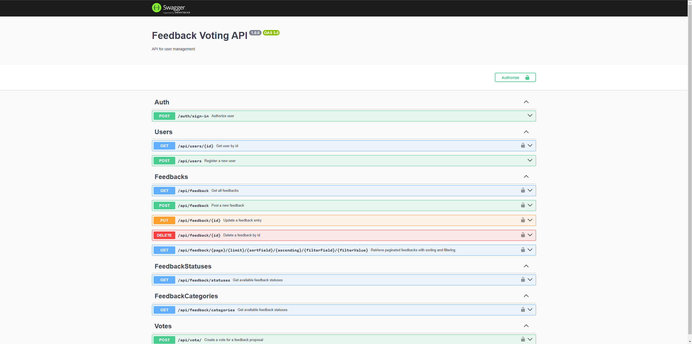
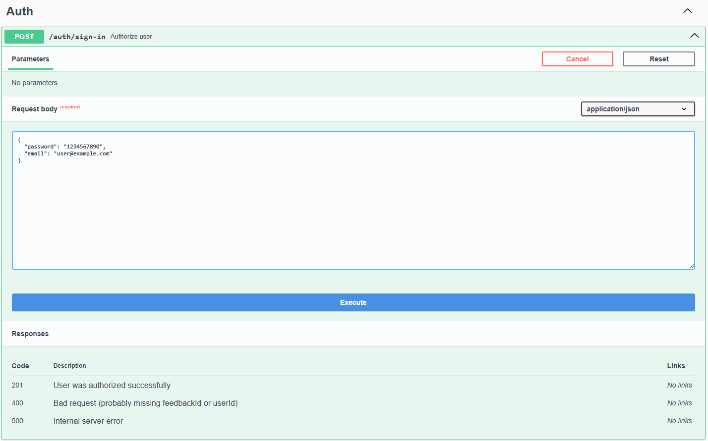
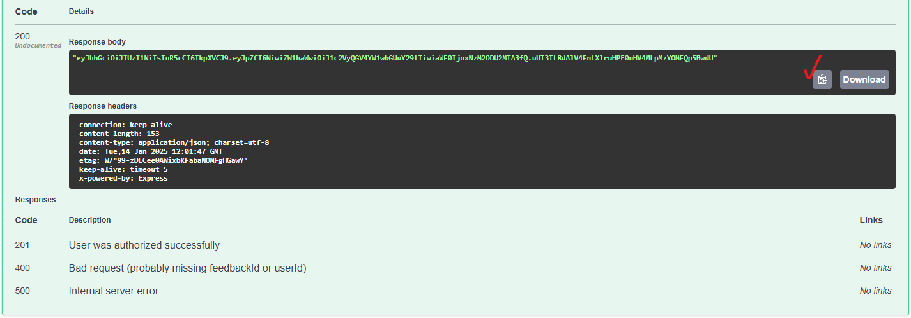
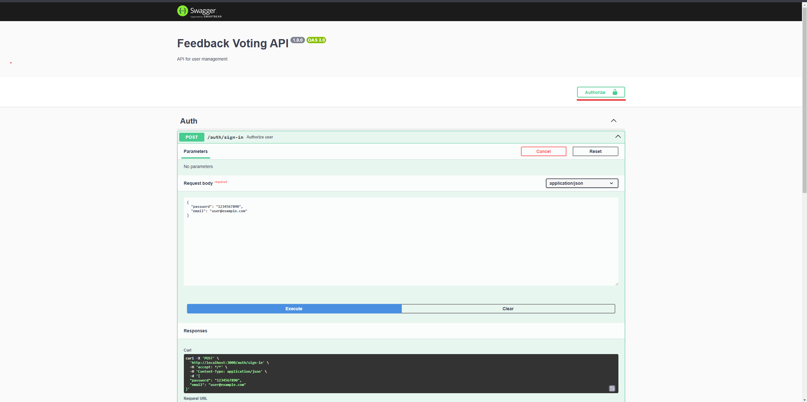
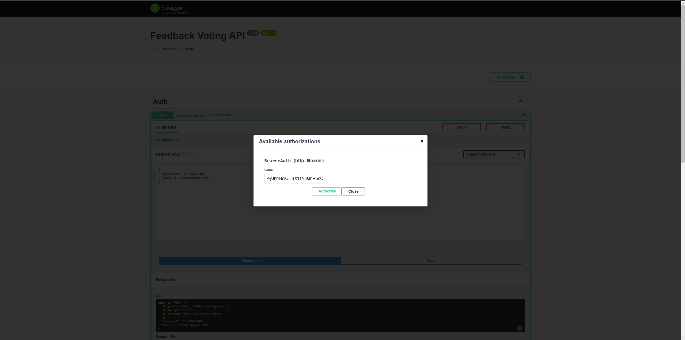
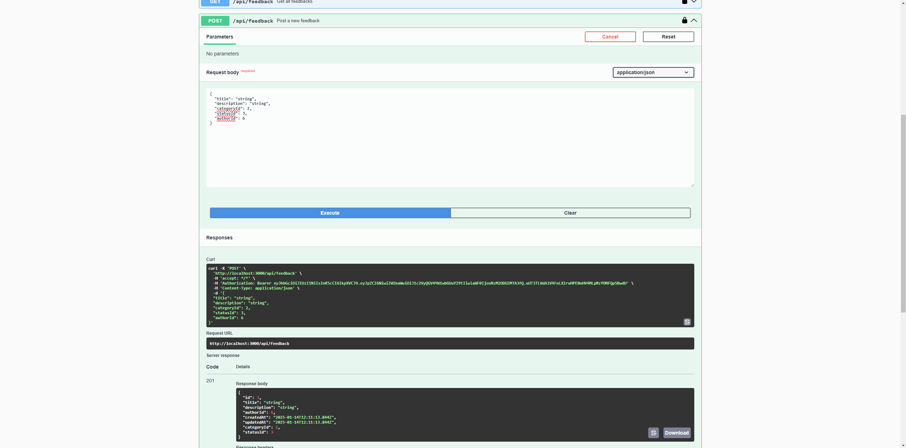
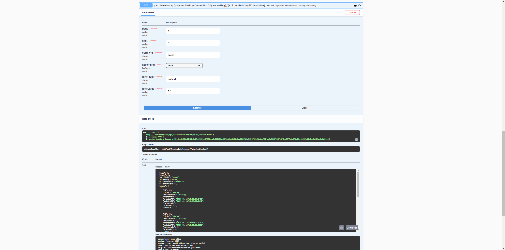

# Feedback voting project:

## All instructions for launching are made from under Ubuntu. If you test the app from Windows, then you may have to install some technologies such as nodejs and docker

## Clone the repository
1. Open Visual Studio Code,
2. Open WSL
3. ```git clone https://github.com/george-leontev/feedback-voting.git```

## Install dependencies
```npm install```

## Startup Instructions
1. Install Docker Engine if necessary: <ins>https://docs.docker.com/engine/install/ubuntu/</ins>

2. Open docker-compose.yaml file.

3. Right-click on the <ins>docker-compose.yaml</ins> file.

4. Click on the **Compose Up** button.

## Set up the database
```npx prisma migrate dev --name init```

## Seed the database
```npm run seed```

### After the Docker container are up and running, start the Node.js application: ```npm run start``` and go to <ins>http://localhost:3000</ins> to use the app :)

# Demo:

## Your localhost must be looks like this:


## Next step to test system is to authorize already existing user:


## After executing a sign-in endpoint we get a jwt token:


## Click on Authorize button:


## Insert your JWT token:


## Finally you can use endpoints:
### Post the feedback for example


## To test pagination, sorting and filtering you must to do some more feedbacks, users and votes
### At first add some users, then feedbacks and finnaly votes
### Then, as in the picture below, pass the parameters
### To see, for example, the second page, you need to make more feedbacks from one author(user)
